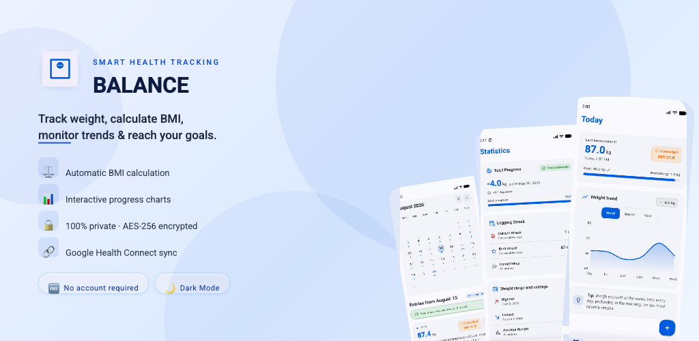
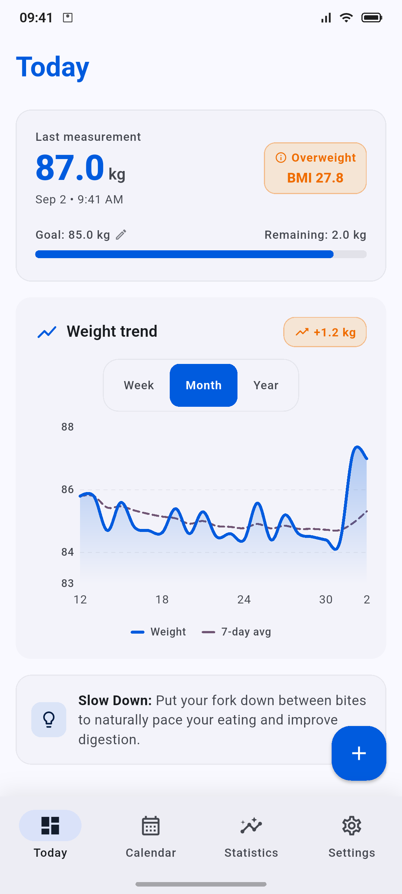
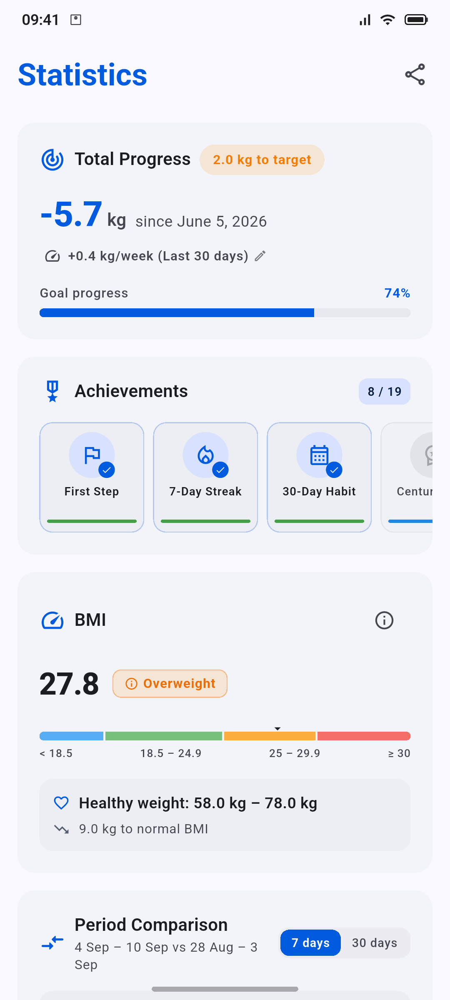
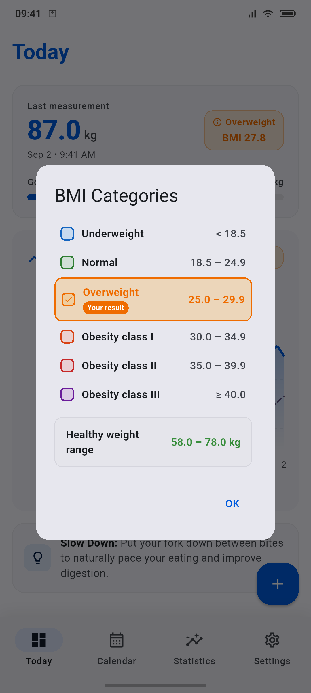
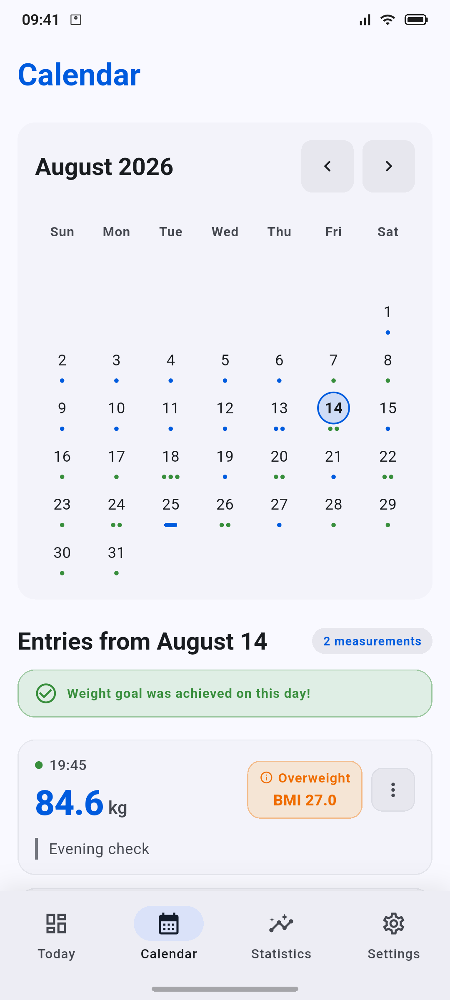
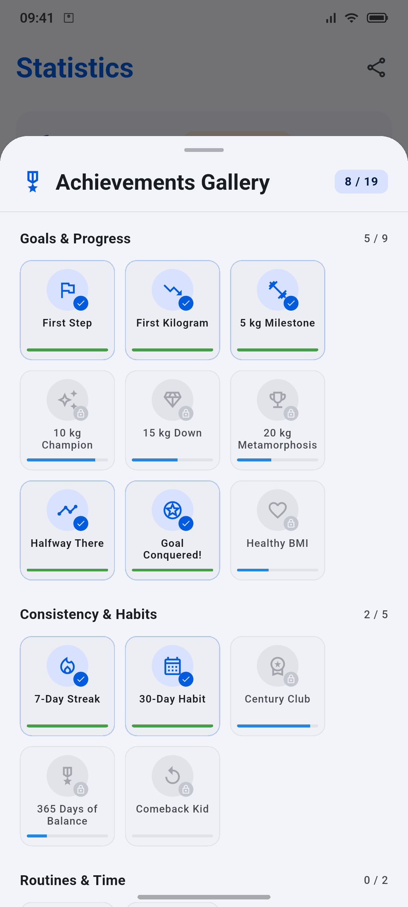
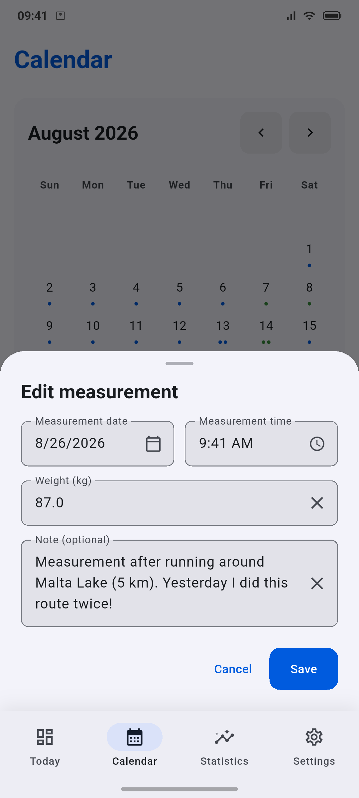
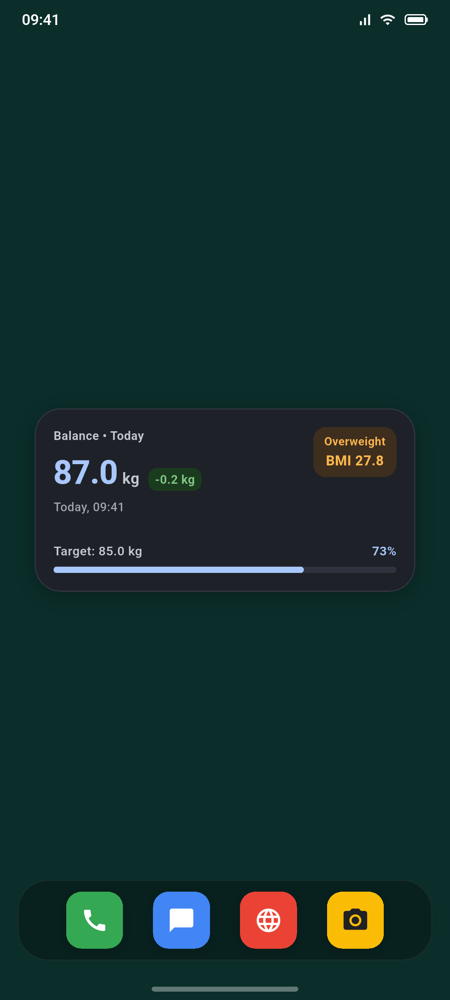
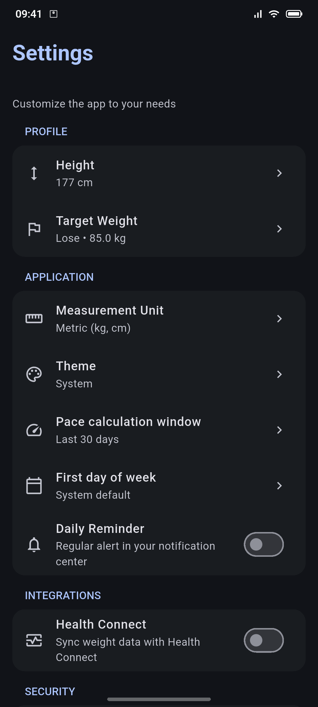

<p align="center">
  
</p>

<h1 align="center">Balance</h1>

<p align="center">
  <strong>A local-first weight tracking application built with Flutter using Clean Architecture and BLoC.</strong>
</p>

<p align="center">
  <a href="https://play.google.com/store/apps/details?id=com.ekerstudio.balance">
    
  </a>
</p>

<p align="center">
  
  
  
  
  
</p>

---

## Screenshots

| Today Dashboard (Light) | Statistics Overview (Light) | WHO BMI Categories (Light) | Calendar & History (Light) |
| :---: | :---: | :---: | :---: |
|  |  |  |  |

| Achievements Gallery (Light) | Edit Measurement (Light) | Home Screen Widget (Dark) | Settings & Health Connect (Dark) |
| :---: | :---: | :---: | :---: |
|  |  |  |  |

---

## Architecture

Clean Architecture strictly organized under a **Feature-First** (vertical slice) layout:

```
lib/
├── app.dart                      # Root application widget (MaterialApp, theme, locale & providers)
├── main.dart                     # App entry point, splash preservation & crash reporting
├── firebase_options.dart         # Auto-configured Firebase credentials per platform
├── core/                         # Cross-cutting concerns & infrastructure
│   ├── bloc/                     # Global BLoC lifecycle observer (AppBlocObserver)
│   ├── config/                   # AppEnvironment (dev, prod configurations)
│   ├── database/                 # Database module & Isar initialization
│   ├── di/                       # Dependency injection setup via GetIt & Injectable
│   ├── errors/                   # Unified app error types & exception handlers
│   ├── integrations/             # Native platform & 3rd-party integration services
│   │   ├── analytics/            # Privacy-first telemetry service (AnalyticsService)
│   │   ├── biometrics/           # Local authentication (Face ID/Fingerprint) & lock observer
│   │   ├── csv/                  # CSV parser, CsvImportService validation & import/export pipelines
│   │   ├── health/               # Apple HealthKit & Android Health Connect sync service
│   │   ├── notifications/        # Local scheduled notifications & timezone management
│   │   └── widgets/              # Android home screen glanceable widgets synchronization service
│   ├── models/                   # Core shared models (MeasurementUnit, TimePeriod)
│   ├── presentation/             # Global app UI & shared design system
│   │   ├── navigation/           # AppRoutes, AppRouter and route definitions
│   │   ├── screens/              # AppSplashScreen, AppInitializationErrorScreen, BiometricShieldScreen
│   │   ├── theme/                # AppTheme (Light & Dark Material 3 tokens), layout tokens & feedback
│   │   └── widgets/              # Reusable components (AppTopBar, ClampedLayout, PillSegmentedControl)
│   └── utils/                    # Shared utilities (AppAnalytics, AppCrashReporter, FieldCipher, UnitConverter)
├── features/                     # Feature modules (Feature-First architecture)
│   ├── calendar/                 # Calendar monthly view, day history & entry sheet
│   ├── dashboard/                # Today's overview, BMI gauge & quick-add weight cards
│   ├── navigation/               # Main navigation scaffold (BottomBar & NavigationRail)
│   ├── onboarding/               # Ephemeral onboarding wizard & OnboardingBloc
│   ├── settings/                 # User preferences, reminders, backup, wipe data & privacy policy
│   ├── statistics/               # Analytics, BMI charts, period comparison & achievements
│   │   ├── domain/               # Milestone & period comparison entities and calculation services
│   │   └── presentation/         # StatisticsScreen, Achievements gallery sheet, trend & habit cards
│   └── weight/                   # Core weight tracking domain, data & state
│       ├── data/                 # WeightEntryModel (Isar schema), IsarWeightRepository & CSV services
│       ├── domain/               # WeightEntry entities, BmiCalculator, domain calculation services & repository contracts
│       └── presentation/         # Shared WeightBloc, events, states & AddWeightSheet
└── l10n/                         # Localization ARB assets (EN, DE, JA, FR, ES, PL, PT-BR, NL, IT, KO)
```

### Design Principles

- **Local-first**: All weight entries persist on-device using Isar (`isar_community`). No cloud dependency.
- **Feature-First**: Strict vertical slicing. Features (`calendar`, `dashboard`, `settings`, etc.) encapsulate their own presentation boundaries, while core business logic remains in the `weight` domain.
- **Dependency Inversion**: Domain defines repository contracts; data layer provides concrete implementations.
- **State Management**: `flutter_bloc` with `hydrated_bloc` for persistent application configuration.
- **Dependency Injection**: `get_it` + `injectable` for compile-time service configuration and modular locator container.
- **Routing & Navigation**: `go_router` with `StatefulShellRoute.indexedStack` preserving individual tab navigation history, deep linking (`/today?action=add`, `/calendar?date=YYYY-MM-DD`), and reactive auth/onboarding redirection guards.

## Tech Stack

| Category | Package | Purpose |
|----------|---------|---------|
| **Framework** | Flutter 3.47.1 | Cross-platform UI framework |
| **State Management** | flutter_bloc, hydrated_bloc | BLoC pattern with automated JSON hydration |
| **Dependency Injection** | get_it, injectable | Service locator and compile-time dependency injection |
| **Routing & Navigation** | go_router | Declarative routing, stateful nested shells, deep linking, and reactive guards |
| **Database** | isar_community | High-performance local NoSQL database |
| **Security & Encryption** | encrypt, crypto, flutter_secure_storage | AES-256 local encryption and hardware-backed Keystore/Keychain key isolation |
| **Charts** | fl_chart | Interactive weight history visualizations |
| **Biometrics** | local_auth | Native biometric authentication (Face ID, Touch ID, fingerprint) |
| **Health** | health | Integration with Apple HealthKit & Android Health Connect |
| **Home Widgets** | home_widget | Android home screen glanceable widgets (2x1, 3x2) |
| **CSV Handling** | csv, file_picker | CSV encoding, streaming parser, and native Storage Access Framework file picker |
| **Localization** | flutter_localizations + gen-l10n | Internationalization (10 languages: EN, DE, JA, FR, ES, PL, PT-BR, NL, IT, KO) |
| **Notifications** | flutter_local_notifications, timezone | Local scheduled daily reminders & timezone resolution |
| **Diagnostics & Crash Reporting** | firebase_crashlytics | Anonymous crash reporting and technical diagnostics |
| **Analytics** | firebase_analytics | Privacy-first telemetry and UI interaction metrics (no health data) |
| **Platform Services** | firebase_core | Firebase platform integration and initialization |

## Key Features

### Weight Tracking & Analytics
- Log daily weight measurements with optional text notes.
- Interactive line charts powered by `fl_chart` with daily entry aggregation and trend insights.
- Filter data by timeframe (`Week`, `Month`, `Year`, `All`).
- **Official WHO BMI Classification**: 6-tier BMI categories (Underweight, Normal, Overweight, Obese Class I/II/III) with dynamic category badges.
- **Healthy Weight Range**: Automatic calculation and visual guidance for target healthy weight boundaries.
- **Milestone Achievements & Gamification**: 19 unlockable achievement badges across 3 categories (*Goals & Progress*, *Consistency & Habits*, *Routines & Time*) with an interactive Achievements Gallery and progress counter.
- **Habit Streaks & Consistency**: Real-time tracking of current weigh-in streak, personal best streak, and consistency percentage across all entries.
- **Period Comparison Analytics**: Compare progress across customizable time intervals (7 days vs previous 7 days, 30 days vs previous 30 days) with average weight, delta indicators, and highest/lowest records.
- Summary metrics: BMI calculation, BMI category badge, target weight progress, and remaining weight delta.
- Automated BMI calculation from configured height.

### Data Management & Integrations
- **Home Screen Widgets**: Native Android desktop widgets (compact 2x1 and detailed 3x2) powered by `home_widget`, displaying current weight, 7-day delta, WHO BMI category badge, and goal progress bar with automatic background synchronization.
- **Health Sync**: Native synchronization with Apple Health (iOS) and Health Connect (Android).
- **CSV Import**: Batch import entries via `CsvImporter` with row validation and isolate background parsing.
- **CSV Export**: Export entries via `CsvExporter` to a CSV file on disk and share via native OS share dialog.
  - Column format: `ID`, `Date`, `Weight (kg)`, `Note`
- **Unit System**: Seamless switching between Metric (kg, cm) and Imperial (lb, ft/in).

### Settings, Onboarding & Security
- **Declarative Navigation & Deep Linking**: Powered by `go_router` 14.x with persistent `StatefulShellRoute` multi-tab state preservation, URI query parsing (`/today?action=add`, `/calendar?date=YYYY-MM-DD`), and reactive auth/onboarding redirection guards.
- **Android 15 Edge-to-Edge & Display Cutouts**: Full compliance with Android 15 (API 35) edge-to-edge drawing, transparent system bars (`enableEdgeToEdge`), camera cutout/notch adaptation (`shortEdges`), and responsive `SafeArea` boundary guards.
- **Predictive Back & Per-App Language**: Modern predictive back gesture support (`PopScope`) and native per-app language configuration (`locales_config.xml`) for Android 13+.
- **Step-by-Step Onboarding**: A comprehensive wizard guiding users through unit selection, initial logging, CSV imports, and permission setups.
- **Theme Options**: Light, Dark, or System mode with Material 3 dynamic styling.
- **Target Tracking**: Configurable target weight goals with dynamic milestone progress.
- **Reminders**: Daily reminder notifications with custom time selection and timezone persistence.
- **Biometric Lock**: Native biometric lock shielding on app cold start and backgrounding with `stickyAuth` set to `true` (persists the authentication prompt across brief backgrounding).

### Privacy, Analytics & Diagnostics
- **100% Local-First Health Data**: All weight entries, target goals, height settings, BMI calculations, and calendar history are stored exclusively in the local on-device database (`isar_community`). No health measurements are sent to external servers or cloud databases.
- **Hardware-Isolated AES-256 Encryption**: Security keys are anchored in hardware-backed Android Keystore / iOS Keychain via `flutter_secure_storage`.
- **Firebase Analytics (`AppAnalytics`)**: Tracks non-sensitive usage metrics (screen navigations, UI interactions, feature engagement) to improve application UX. In strict adherence to privacy principles, **all raw health measurements (weights, heights, BMI numbers, goal targets) are omitted from telemetry payloads**. Analytics collection is automatically disabled in debug mode (`kDebugMode`).
- **Firebase Crashlytics (`AppCrashReporter`)**: Captures non-fatal error reports and fatal crash stack traces for real-time defect diagnosis and performance stability. Crash logs contain technical error diagnostics and stack traces without any identifiable user health information.

## Getting Started

### Prerequisites

- Dart SDK >= 3.12.2 (Flutter >= 3.47.1) — pinned via `.flutter-version`
- Android Studio Ladybug+ (Android API 26–35) / Xcode 15+ (iOS)

### Setup

```bash
flutter pub get
dart run build_runner build --delete-conflicting-outputs
```

### Run

```bash
flutter run
```

## Project Conventions

### Database Engine
- Isar schema configuration uses the `balance_v1` store name (encrypted schema; legacy `pure_weight_v1` and `pure_weight_v2` stores are quarantined on first launch).
- `DatabaseModule` manages initialization, integrity verification, and fallback database recovery (`.isar.bak`).
- Native database-level sorting via `.where().sortByDateTimeDesc()` runs directly inside Isar query streams.

### State Management
- **`WeightBloc`**: Controls weight entries, chart period filtering, and platform sync pipelines.
  - Events: `SubscribeToWeightChanges`, `AddWeight`, `DeleteWeight`, `ChangeChartFilter`, `RefreshWeightData`, `SyncHealthEntries`, `ImportCsvEntries`
  - States: `WeightInitial`, `WeightLoading`, `WeightLoaded`, `WeightError`
- **`AppSettingsBloc`**: Manages persistent user preferences via `HydratedBloc`.
  - Events: `UpdateTheme`, `UpdateMeasurementUnit`, `UpdateHeight`, `TargetWeightChanged`, `UpdateBiometricLock`, `ToggleNotifications`, `UpdateNotificationTime`, `ToggleHealthSync`, `SetLocked`, `ClearAllData`
  - State: `AppSettingsState` (hydrated and encrypted on-device).
- **`OnboardingBloc`**: Controls the ephemeral multi-step initial setup wizard state machine.
  - Events: `OnboardingStarted`, `OnboardingStepChanged`, `OnboardingUnitSelected`, `OnboardingInitialWeightSet`, `OnboardingTargetWeightSet`, `OnboardingNotificationsToggled`, `OnboardingHealthSyncToggled`, `OnboardingCompleted`
  - State: `OnboardingState` (holds temporary wizard draft values and emits UI states; decoupled from sibling BLoCs with persistence orchestrated by the wizard presentation layer upon completion).

### Code Generation

Generate code for Isar schema models and dependency injection:

```bash
dart run build_runner build --delete-conflicting-outputs
```

Regenerate the app icon (light, dark, monochrome, and adaptive variants) and the native splash screen after updating the source images in `assets/icon/`:

```bash
# Generate App Icons
dart run flutter_launcher_icons

# Generate Native Splash Screen
dart run flutter_native_splash:create
```

## Testing & Quality Assurance

Run the comprehensive 7-phase quality and verification pipeline before freezing or pushing code:

```bash
./scripts/before_push.sh
```

The script automatically executes and validates:
1. `flutter pub get` — Resolves workspace dependencies
2. `flutter gen-l10n` — Regenerates localization classes
3. `dart run build_runner build` — Regenerates Isar and Injectable code
4. `dart format --set-exit-if-changed lib test integration_test test_driver` — Strict formatting verification
5. `flutter analyze` — Static linter verification (0 warnings/errors)
6. `flutter test --exclude-tags golden,screenshot` — Comprehensive automated test suite (1177 passing tests)
7. `flutter build apk --debug` — Android compilation integrity check

Or execute unit/widget tests directly:

```bash
flutter test --exclude-tags golden,screenshot
```

### Screenshots

Generate localized screenshots for Play Store (10 locales × 2 themes):

```bash
# Full suite (all features, phone)
./scripts/screenshots/generate_screenshots.sh phone

# Single feature or locale
./scripts/screenshots/generate_settings.sh phone pl
./scripts/screenshots/run_screenshot_target.sh integration_test/calendar_screenshots_test.dart phone pl
```

Screenshots are rendered with `ScreenshotDeviceFrame` (status bar 09:41, gesture pill) and stored in `screenshots/` (ignored) — curated assets for README are in `.github/assets/`.

## CSV Specifications

CSV import and export conform to the following 4-column layout:

```csv
ID,Date,Weight (kg),Note
1,2026-07-29 08:00,72.5,Morning weigh-in
2,2026-07-28 08:00,73.0,
```

- `ID`: Auto-increment integer primary key.
- `Date`: Timestamp formatted as `yyyy-MM-dd HH:mm`.
- `Weight (kg)`: Numeric value in kilograms (1 decimal place).
- `Note`: Optional user note string.

## Biometric Security Setup

**iOS**: Include `NSFaceIDUsageDescription` in `ios/Runner/Info.plist`.

**Android**: Declare `<uses-permission android:name="android.permission.USE_BIOMETRIC" />` in `android/app/src/main/AndroidManifest.xml`.

## AI-Native Engineering & Developer Resources (#built_in_public)

As part of our commitment to building in public and advancing agentic workflows, this repository includes battle-tested, token-budget-safe audit frameworks and prompts in the [`prompts/`](prompts/) directory:

- **[BLoC Architecture Deep Audit](prompts/flutter_architect_deep_bloc_audit.md)**: Exhaustive 12-dimension technical and architectural audit framework tailored for Flutter + BLoC + Isar apps.
- **[Riverpod Architecture Deep Audit](prompts/flutter_architect_deep_riverpod_audit.md)**: Exhaustive 12-dimension technical and architectural audit framework tailored for Flutter + Riverpod + Isar apps.
- **[Unit Test Auditor Framework](prompts/flutter_unit_test_audit_framework_en.md)**: Iterative, bounded-context audit and test generation framework for Flutter unit tests.
- **[i18n / L10n Localization Audit](prompts/flutter_i18n_l10n_audit_en.md)**: Chunked, stateful localization auditor for `.arb` + `flutter gen-l10n` toolchains.
- **[Comments & DartDoc Cleanup Prompt](prompts/flutter_comments_dartdoc_cleanup_prompt_en.md)**: Memory-safe, file-by-file comment translation and documentation refactoring prompt.

## Branches

- `develop` — default integration branch. All feature PRs target `develop`.
- `release` — release branch. APK & AAB built via `release.yml` on push to `release` or tag `v*`.
- `feature/*` — feature branches from `develop`.

See [CONTRIBUTING](.github/CONTRIBUTING.md) for workflow and PR templates.

## License

This project is licensed under the MIT License - see the [LICENSE](LICENSE) file for details.
