<p align="center">
  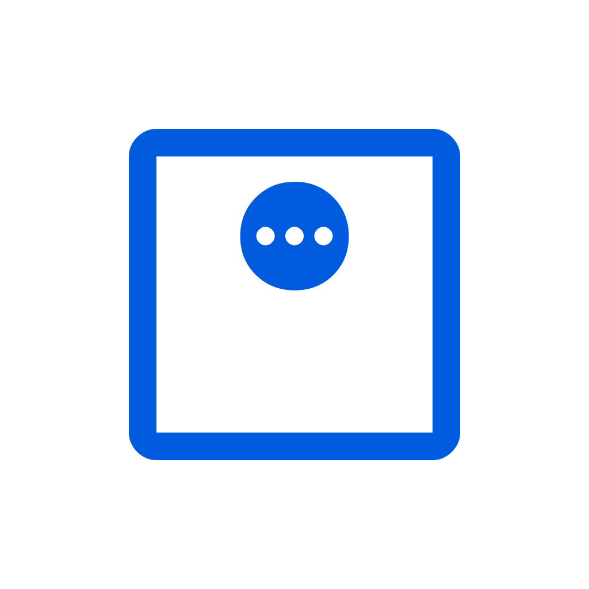
</p>

<h1 align="center">Balance</h1>

<p align="center">
  <strong>A local-first weight tracking application built with Flutter using Clean Architecture and BLoC.</strong>
</p>

<p align="center">
  
  
  
  
  
</p>

---

## Screenshots

### Core Experience (Light & Dark)

| Today Dashboard (Light) | Add Measurement (Dark) | Statistics Overview (Light) | Trend & BMI Analysis (Dark) |
| :---: | :---: | :---: | :---: |
| 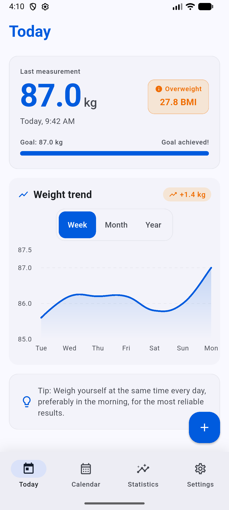 | 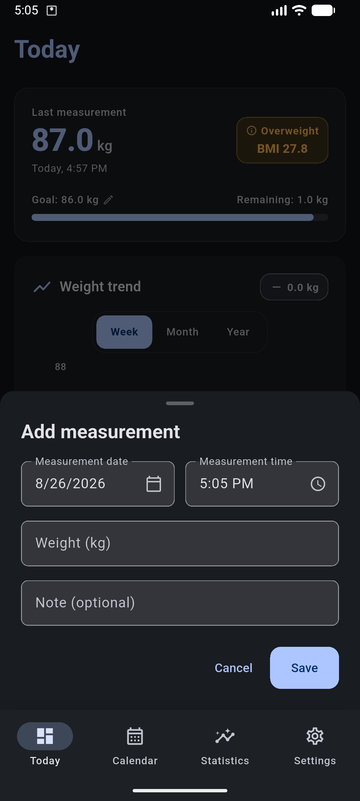 | 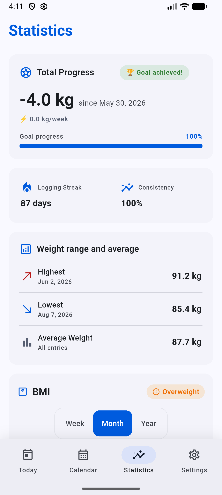 | 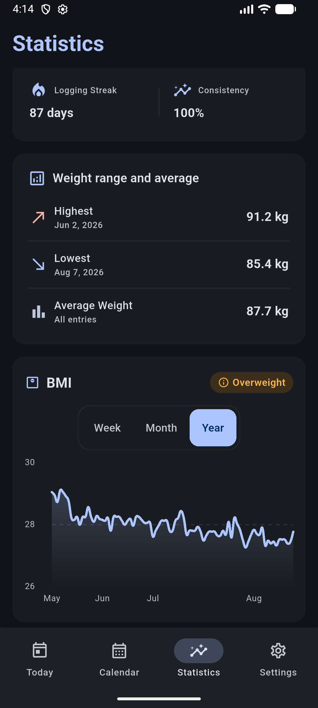 |

### Calendar & Settings

| Calendar Goals (Light) | Add Measurement Sheet (Light) | Calendar Month (Dark) | Settings (Light) | CSV Import Preview (Dark) |
| :---: | :---: | :---: | :---: | :---: |
| 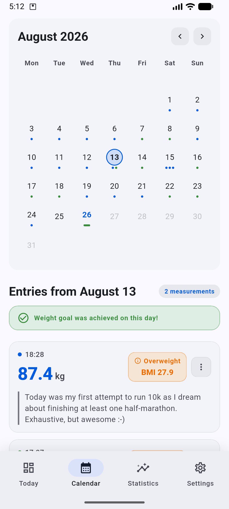 | 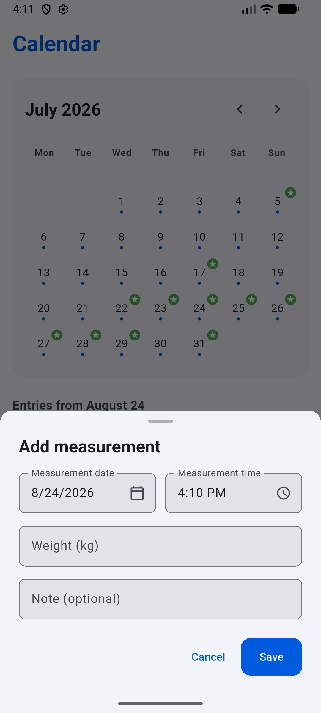 | 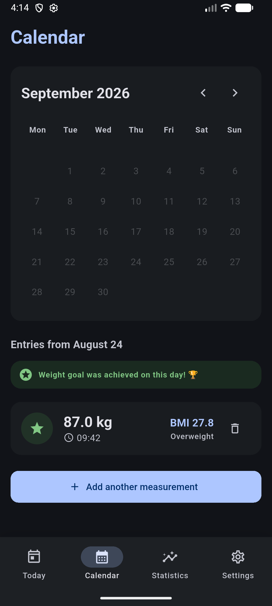 | 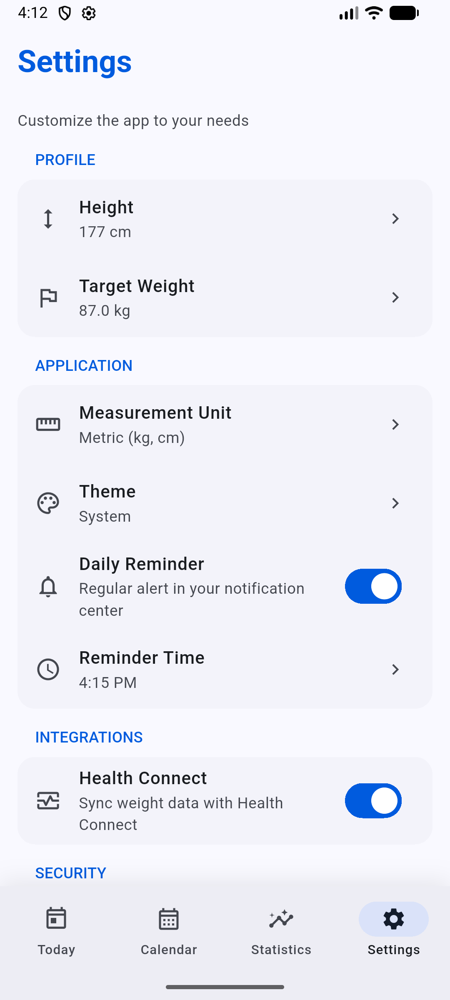 | 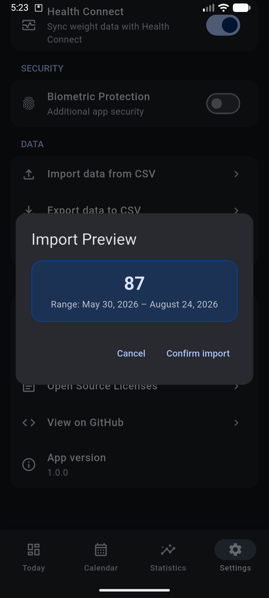 |

### Onboarding & Splash

| Splash Screen (Light) | Onboarding Welcome (Light) | CSV History Import (Light) | Splash Screen (Dark) |
| :---: | :---: | :---: | :---: |
| 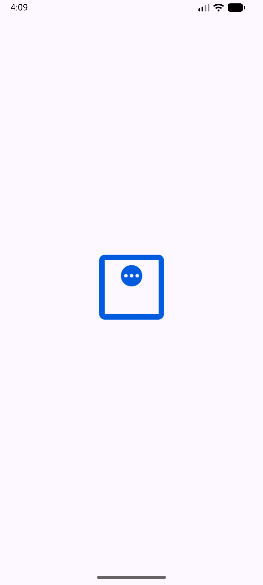 | 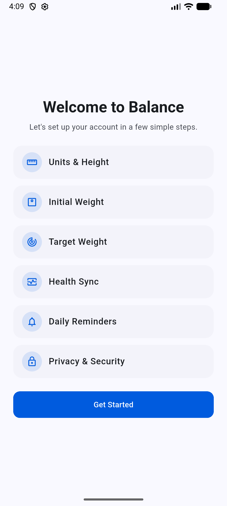 | 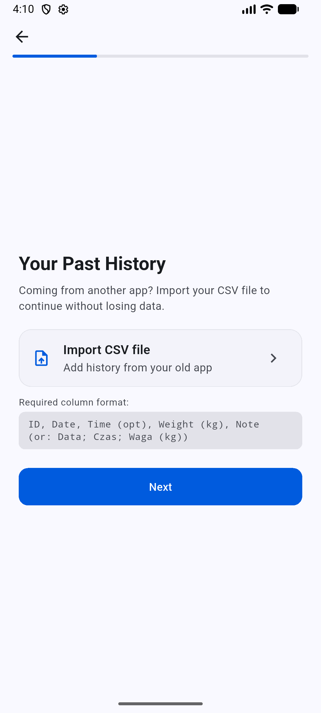 | 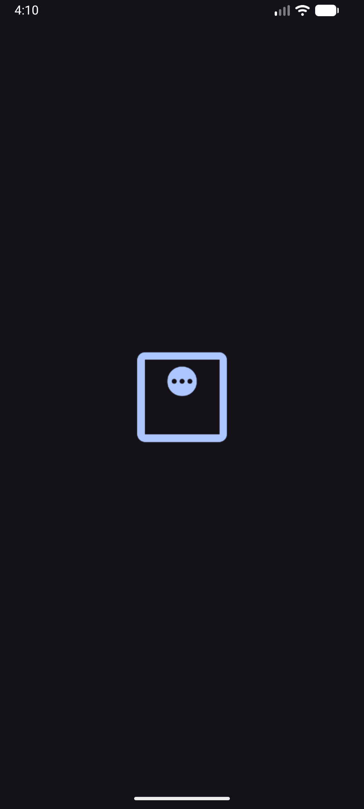 |

---

## Architecture

Clean Architecture strictly organized under a **Feature-First** (vertical slice) layout:

```
lib/
├── app.dart                      # Root application widget
├── main.dart                     # App entry point & database initialization
├── core/                         # Cross-cutting concerns
│   ├── database/                 # Database module & recovery logic
│   ├── integrations/             # Native platform & 3rd-party services
│   │   ├── biometrics/           # Local authentication & lock observer
│   │   ├── csv/                  # CSV import/export pipelines
│   │   ├── health/               # Apple HealthKit & Android Health Connect
│   │   └── notifications/        # Scheduled daily local reminders
│   ├── models/                   # Core models (MeasurementUnit)
│   └── utils/                    # Shared utilities (FieldCipher, UnitConverter)
├── features/                     # Feature modules
│   ├── calendar/                 # Calendar view and historical day entries
│   ├── dashboard/                # Today's overview, BMI, and quick-add
│   ├── navigation/               # Main bottom navigation scaffold
│   ├── onboarding/               # 8-step initial setup wizard
│   ├── settings/                 # User preferences & configuration
│   ├── statistics/               # Analytical charts and history trends
│   └── weight/                   # Core weight tracking domain & data
│       ├── data/                 # WeightEntryModel (Isar) & Repositories
│       ├── domain/               # Entities, Domain Contracts, Error Types
│       └── presentation/         # Shared WeightBloc & Events
├── l10n/                         # Localization ARB assets (app_en.arb, app_pl.arb)
└── presentation/                 # Global UI & App-level components
    ├── core/                     # ClampedLayout responsive wrapper
    ├── screens/                  # AppSplash, InitializationError, BiometricShield
    ├── theme/                    # AppTheme (Light & Dark Material 3)
    └── widgets/                  # Shared global widgets (AppTopBar, StateMessageCard)
```

### Design Principles

- **Local-first**: All weight entries persist on-device using Isar (`isar_community`). No cloud dependency.
- **Feature-First**: Strict vertical slicing. Features (`calendar`, `dashboard`, `settings`, etc.) encapsulate their own presentation boundaries, while core business logic remains in the `weight` domain.
- **Dependency Inversion**: Domain defines repository contracts; data layer provides concrete implementations.
- **State Management**: `flutter_bloc` with `hydrated_bloc` for persistent application configuration.
- **Dependency Injection**: Manual DI in `main.dart` — dependencies instantiated explicitly and passed down via widget constructors and BLoC providers.

## Tech Stack

| Category | Package | Purpose |
|----------|---------|---------|
| **Framework** | Flutter 3.44 | Cross-platform UI framework |
| **State Management** | flutter_bloc, hydrated_bloc | BLoC pattern with automated JSON hydration |
| **Dependency Injection** | Manual DI | Dependencies wired explicitly in `main.dart`, passed via constructors and BLoC providers |
| **Database** | isar_community | High-performance local NoSQL database |
| **Charts** | fl_chart | Interactive weight history visualizations |
| **Biometrics** | local_auth | Native biometric authentication (Face ID, Touch ID, fingerprint) |
| **Health** | health | Integration with Apple HealthKit & Android Health Connect |
| **CSV Handling** | csv | CSV encoding and parsing pipeline |
| **Localization** | flutter_localizations + gen-l10n | Internationalization (English, Polish) |
| **Notifications** | flutter_local_notifications | Local scheduled daily reminders |

## Key Features

### Weight Tracking & Analytics
- Log daily weight measurements with optional text notes.
- Interactive line charts powered by `fl_chart` with daily entry aggregation.
- Filter data by timeframe (`Week`, `Month`, `Year`, `All`).
- Summary metrics: BMI calculation, BMI category badge, target weight progress, and remaining weight delta.
- Automated BMI calculation from configured height.

### Data Management & Integrations
- **Health Sync**: Native synchronization with Apple Health (iOS) and Health Connect (Android).
- **CSV Import**: Batch import entries via `CsvImporter` with row validation and isolate background parsing.
- **CSV Export**: Export entries via `CsvExporter` to a CSV file on disk and share via native OS share dialog.
  - Column format: `ID`, `Date`, `Weight (kg)`, `Note`
- **Unit System**: Seamless switching between Metric (kg, cm) and Imperial (lb, ft/in).

### Settings, Onboarding & Security
- **8-Step Onboarding**: A comprehensive wizard guiding users through unit selection, initial logging, CSV imports, and permission setups.
- **Theme Options**: Light, Dark, or System mode.
- **Target Tracking**: Configurable target weight goals.
- **Reminders**: Daily reminder notifications with custom time selection.
- **Biometric Lock**: Native biometric lock shielding on app cold start and backgrounding with `stickyAuth` set to `true` (persists the authentication prompt across brief backgrounding).

## Getting Started

### Prerequisites

- Flutter SDK >= 3.12
- Xcode (iOS) / Android Studio (Android)

### Setup

```bash
flutter pub get
dart run build_runner build
```

### Run

```bash
flutter run
```

## Project Conventions

### Database Engine
- Isar schema configuration uses the `balance_v1` store name (encrypted schema; legacy `pure_weight_v1` and `pure_weight_v2` stores are quarantined on first launch).
- `DatabaseModule` manages initialization, integrity verification, and fallback database recovery (`.isar.bak`).
- Native database-level sorting via `.where().sortByDateTimeDesc()` runs directly inside Isar query streams.

### State Management
- **`WeightBloc`**: Controls weight entries and chart period filtering.
  - Events: `SubscribeToWeightChanges`, `UpdateUserHeight`, `AddWeight`, `DeleteWeight`, `ChangeChartFilter`, `RefreshWeightData`
  - States: `WeightInitial`, `WeightLoading`, `WeightLoaded`, `WeightError`
- **`AppSettingsBloc`**: Manages user configuration via `HydratedBloc`.
  - Events: `UpdateTheme`, `UpdateMeasurementUnit`, `UpdateHeight`, `TargetWeightChanged`, `UpdateBiometricLock`, `ToggleNotifications`, `UpdateNotificationTime`, `SetLocked`, etc.
  - State: `AppSettingsState` (persisted to storage).

### Code Generation

Generate code for Isar schema models:

```bash
dart run build_runner build
```

Regenerate the app icon (light, dark, monochrome, and adaptive variants) and the native splash screen after updating the source images in `assets/icon/`:

```bash
# Generate App Icons
dart run flutter_launcher_icons

# Generate Native Splash Screen
dart run flutter_native_splash:create
```

## Testing

Run full verification suite (over 970+ tests):

```bash
./scripts/before_push.sh
```

Or execute unit/widget tests directly:

```bash
flutter test
```

## CSV Specifications

CSV import and export conform to the following 4-column layout:

```csv
ID,Date,Weight (kg),Note
1,2026-07-29 08:00,72.5,Morning weigh-in
2,2026-07-28 08:00,73.0,
```

- `ID`: Auto-increment integer primary key.
- `Date`: Timestamp formatted as `yyyy-MM-dd HH:mm`.
- `Weight (kg)`: Numeric value in kilograms (1 decimal place).
- `Note`: Optional user note string.

## Biometric Security Setup

**iOS**: Include `NSFaceIDUsageDescription` in `ios/Runner/Info.plist`.

**Android**: Declare `<uses-permission android:name="android.permission.USE_BIOMETRIC" />` in `android/app/src/main/AndroidManifest.xml`.

## License

Private / All rights reserved.
